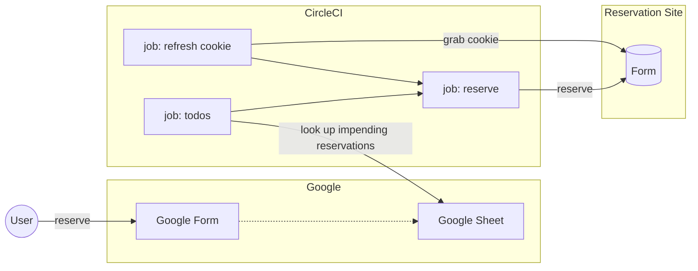

# reserve
Demo app to showcase schedule-based court reservation

## Scenario Requirements

- Court can only be reserved 2 month prior earliest
- Reservation is open from 00:00 JST
- Court reservation is done on a web form (requires cookies)

## Infrastructure

## How it works

1. Google Form captures all upcoming reservations
2. Workflow runs on CircleCI, at 23:00+ JST every day:
   1. Job grabs cookie from site, and save to workspace
   2. Another job looks up all reservations to make this 00:00 hour
   3. Final job waits until 00:00 to run reservations
